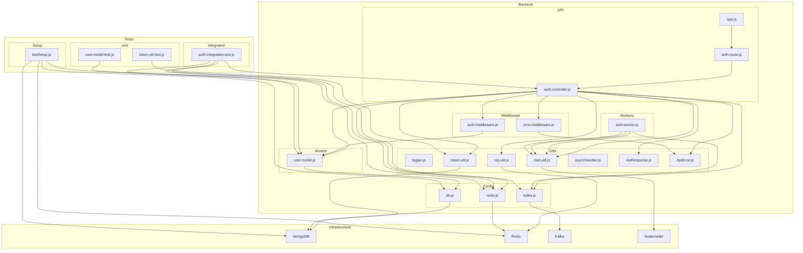

    

    <b>Automatic Architecture Diagrams from Code</b> 
    <a href="https://github.com/JashanMaan28/swark-continued">GitHub (Fork)</a> • <a href="https://github.com/swark-io/swark">Original Project</a>

## Usage Instructions

1. **Render the Diagram**: Use the links below to open it in Mermaid Live Editor, or install the [Mermaid Support](https://marketplace.visualstudio.com/items?itemName=bierner.markdown-mermaid) extension.
2. **Recommended Model**: If available for you, use `gemini` [language model](vscode://settings/swark-continued.languageModel). It can process more files and generates better diagrams.
3. **Iterate for Best Results**: Language models are non-deterministic. Generate the diagram multiple times and choose the best result.

## Generated Content
**Model**: GPT-4o - [Change Model](vscode://settings/swark-continued.languageModel)  
**Mermaid Live Editor**: [View](https://mermaid.live/view#pako:eNqVVV1vmzAU_SuRn9tINqyV8jApBArR1GlqO_XB9MENDmEBG9lG1VT1v8-AWbmETBlPnHvuPdf3w_COdjLjaIVSkStWHxZPYSoW9tHNa28I2O7IRdZbAbP-sf20ts8aU1bXy1_6ZWInlDXmsFSyMXyG9np6J4VRsiy5gj7z2e-LLCv5G1McqgW4V6v-8qcZA0K5UlKddTqT0raq1FBqg2mj7YmrlrtE5KcpphohpqXM82ndHUVoxYpy2dioGdajRtrpnKN9Kk19jvxCmf4tdgkTWTmb-oau6-KB61oKPdPE8Lblo66PF9S9kWJf5FAiwjR7PVWOCFU8K_QM49Ej2x_ZJQmfpTpyNWn1nduOt448I9O9TK7BE9dGz41TFAamiPF4KMbGndYRk_HWnPrMV7QVhts3U0gxkXM3qPh0uFj0kZumnsj5tI3umP9o0VbsFdNGNTvTjG9lgum9FLkMg5FSQuhDO-OxyaPf2uGOTT79blvUXgGuXk5Sr_Hi-vqr_b44SHroOeh1cIMBDCEb-hASACPoHEE2vIHwFsAA5g1cbIDBqQICYjc9Gzk27NnEHTLspZKB9XvolCMM2IhA1sW6iu4wKNDBofx_wxiDTsYEVBR7YAqxN8cOnYxhn2MflD9AAmAC2bZAdIUqruyaZPZX9p4ic-AVT9FqkaKM71lTmhR9WKemzpjhYcHsxlZoZXeVXyF7deSj_RIO2P6m8gNa7Vmp-ccffK_hiA) | [Edit](https://mermaid.live/edit#pako:eNqVVV1vmzAU_SuRn9tINqyV8jApBArR1GlqO_XB9MENDmEBG9lG1VT1v8-AWbmETBlPnHvuPdf3w_COdjLjaIVSkStWHxZPYSoW9tHNa28I2O7IRdZbAbP-sf20ts8aU1bXy1_6ZWInlDXmsFSyMXyG9np6J4VRsiy5gj7z2e-LLCv5G1McqgW4V6v-8qcZA0K5UlKddTqT0raq1FBqg2mj7YmrlrtE5KcpphohpqXM82ndHUVoxYpy2dioGdajRtrpnKN9Kk19jvxCmf4tdgkTWTmb-oau6-KB61oKPdPE8Lblo66PF9S9kWJf5FAiwjR7PVWOCFU8K_QM49Ej2x_ZJQmfpTpyNWn1nduOt448I9O9TK7BE9dGz41TFAamiPF4KMbGndYRk_HWnPrMV7QVhts3U0gxkXM3qPh0uFj0kZumnsj5tI3umP9o0VbsFdNGNTvTjG9lgum9FLkMg5FSQuhDO-OxyaPf2uGOTT79blvUXgGuXk5Sr_Hi-vqr_b44SHroOeh1cIMBDCEb-hASACPoHEE2vIHwFsAA5g1cbIDBqQICYjc9Gzk27NnEHTLspZKB9XvolCMM2IhA1sW6iu4wKNDBofx_wxiDTsYEVBR7YAqxN8cOnYxhn2MflD9AAmAC2bZAdIUqruyaZPZX9p4ic-AVT9FqkaKM71lTmhR9WKemzpjhYcHsxlZoZXeVXyF7deSj_RIO2P6m8gNa7Vmp-ccffK_hiA)

